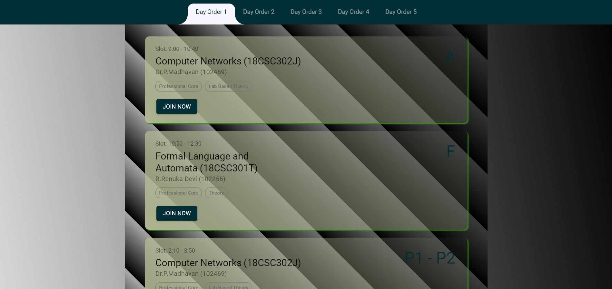
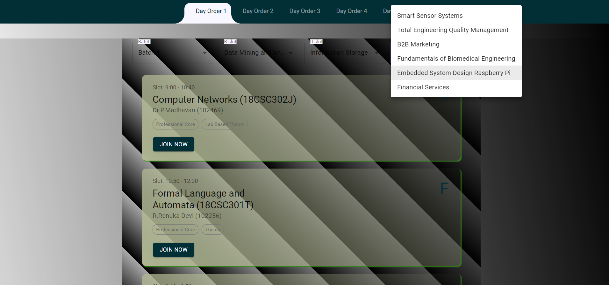

<h1 align="center">Welcome to SRM-TimeTable Web-App 👋</h1>
<p>
  
  <a href="to be added" target="_blank">
    
  </a>
  <a href="nonee" target="_blank">
    
  </a>
  </p>

  > A simple Web-App displaying the time slots of respective subjects with their joining meet link.

  ## PREVIEW

<p align="center">
  
  
 
</p>

  ## Install

```sh
npm install
```

## Usage

```sh
npm start
```

## Run tests

```sh
npm run test
```


## Author

👤 **Akshat Sachan**

* Website: sachan.netlify.com
* Twitter: [SachanAK36](https://twitter.com/sachanaks36)
* Github: [CryptocoderAS](https://github.com/CryptocoderAS)
* LinkedIn: [Akshat Sachan](https://www.linkedin.com/in/akshat-sachan-58b2921ab/)

## Show your support

Give a ⭐️ if this project helped you!

## 📝 License
Original Repo [Md. Muazam](https://github.com/mmuazam98/mytimetable) <br>
Copyright © 2021 [Akshat Sachan](https://github.com/CryptocoderAS).<br />
This project is [Open Source](none) licensed. <br>

